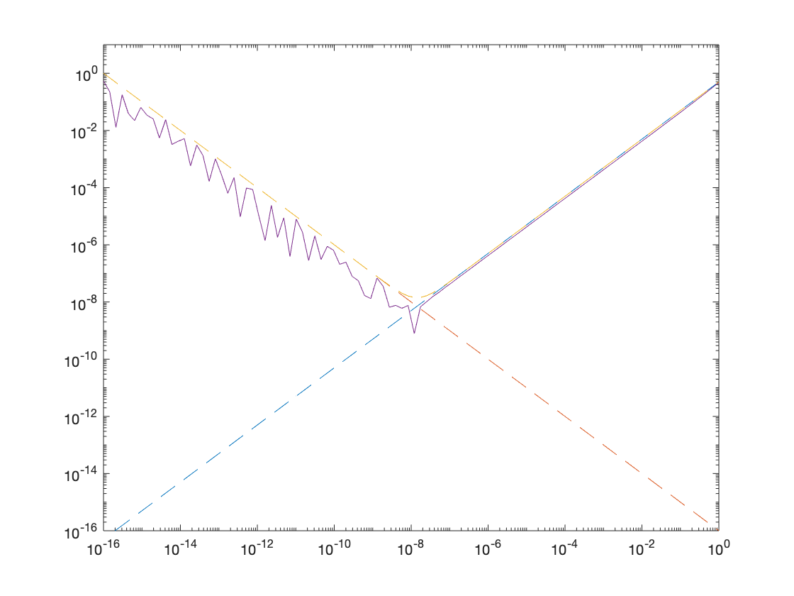
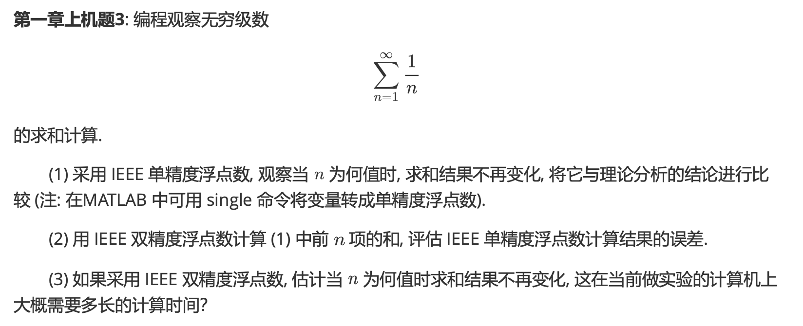
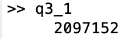
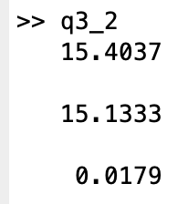

# Report Chap 1

成镇宇 2017080068 计76

## 实验一

### 实验题目


### 解题思路 && 实验结果

根据书中的误差计算即可求出

```matlab
h = logspace(-16, 0, 100);
trunck = h / 2;
round = 0.0000000000000001 * h.^(-1);
epsilon_tot = trunck + round;
error = abs(((sin(1 + h) - sin(1)) ./ h) - cos(1));
plot(h, trunck, h, round, h, epsilon_tot, h, error);
loglog(h, trunck, '--', h, round, '--', h, epsilon_tot, '--', h, error);
axis([0.0000000000000001 1 0.0000000000000001 10]);
```



## 实验二

### 实验题目



### 解题思路 && 实验结果

1. 循环记下来sum和上一次循环的值直到两者差为0

   ```matlab
   sum = single(0);
   previous = single(-1);
   i = 0;
   while sum - previous ~= 0
       i = i + 1;
       previous = sum;
       sum = sum + single(1/i);
   end
   
   disp(i);
   ```

   

2. 与上一题类似，只需要改用成double即可

   ```matlab
   sum_single = single(0);
   previous = single(-1);
   i = 0;
   
   while sum_single - previous ~= 0
       i = i + 1;
       previous = sum_single;
       sum_single = sum_single + single(1/i);
   end
   
   sum_double = double(0);
   j = 0;
   while j - i ~= 0
       j = j + 1;
       sum_double = sum_double + double(1/j);
   end
   
   disp(sum_single);
   disp(sum_double);
   disp((sum_single - sum_double) / sum_double);
   ```

   

3. double最多支持16为有效数字，所以当1/n = 5 * 10^(-16)时，达到了最大精度。本人用的机器时2.9GHz，可依据算出来需要689655.1724137932秒。