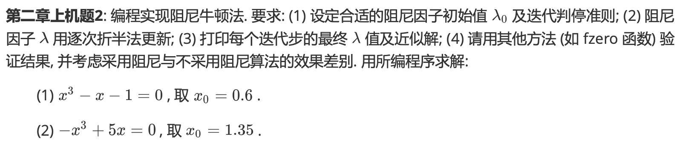
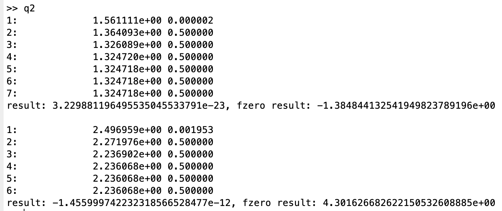
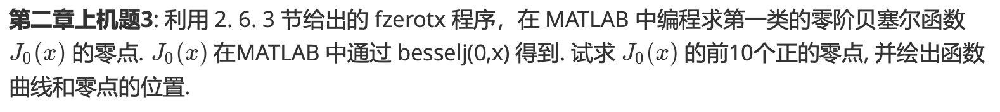
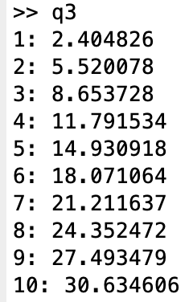

# Report Chap 1

成镇宇 2017080068 计76

## 实验一

### 实验题目



### 解题思路 && 实验结果

根据书中的阻尼牛顿法的实现即可

```matlab
syms x;
f1(x) = x^3 - x - 1;
x_01 = 0.6;
 
fun1 = @(x) f1(x);
x_fzero1 = fzero(fun1, x_01);

xk1 = -1;
xkk1 = x_01;
lambda = 1;

fdiff1 = diff(f1);

k = 0;
while abs(xk1 - xkk1) > 0.000000000001
    xk1 = xkk1;
    s = f1(xk1) / fdiff1(xk1);
    xkk1 = xk1 - s;
    i = 1;
    while abs(f1(xkk1)) >= abs(f1(xk1))
        xkk1 = xk1 - s * lambda / i;
        i = i + 1;
    end
    fprintf("%d: %24e %f\n", k+1, xkk1, lambda / (2^i));
    k = k + 1;
end

fprintf("result: %.24e, fzero result: %.24e \n\n", f1(xk1), f1(x_fzero1));

% ----------------------------------------------
f2(x) = - x^3 + 5*x;
x_02 = 1.35;
 
fun2 = @(x) f2(x);
x_fzero2 = fzero(fun2, x_02);

xk2 = -1;
xkk2 = x_02;
lambda = 1;

fdiff2 = diff(f2);

k = 0;
while abs(xk2 - xkk2) > 0.000000000001
    xk2 = xkk2;
    s = f2(xk2) / fdiff2(xk2);
    xkk2 = xk2 - s;
    i = 1;
    while abs(f2(xkk2)) >= abs(f2(xk2))
        xkk2 = xk2 - s * lambda / i;
        i = i + 1;
    end
    fprintf("%d: %24e %f\n", k+1, xkk2, lambda / (2^i));
    k = k + 1;
end

fprintf("result: %.24e, fzero result: %.24e \n", f2(xk2), f2(x_fzero2));
```



## 实验二

### 实验题目



### 解题思路 && 实验结果

通过计算左右两半的第一类零阶besselj的间距，并将结果套入书中给出的fzerotx程序中求出贝塞尔函数的零点。

```matlab
l = 0.0000000000000000000001;
r = l;
off = 0.0001;

i = 1;
while i <= 10
    while besselj(0,l) * besselj(0,r) > 0
        r = r + 0.01;
    end
    r = fzerotx(@ (Z) besselj(0,Z),[l,r]);
    fprintf("%d: %f\n",i,r);
    l = r + off;
    r = l;
    i = i + 1;
end
```



