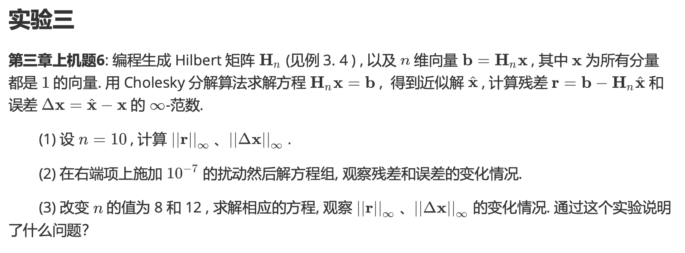
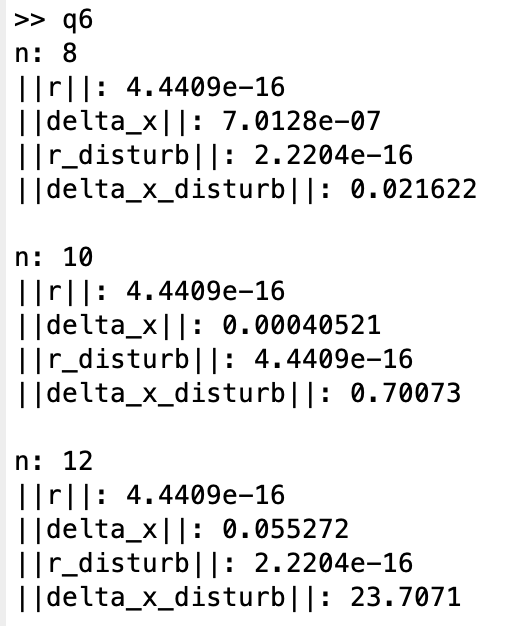

# Report Chap 3

成镇宇 2017080068 计76

## 实验一

### 实验题目



### 解题思路 && 实验结果

第一二三题都一起实现：

```matlab
for n = [8, 10, 12] % n = 10是第一题，8和12都是第三题
  Hn = hilb(n); % 生成Hilbert Matrix，第一题n=10
  x = ones(n,1); % n维向量x
  b = Hn * x; % n维向量公式
  L = cholesky(Hn); % 分解Hn
  x_hat = L.' \ (L \ b); % 求x的近似解
  r = b - Hn * x_hat; % 求残差
  delta_x = x_hat - x; % 求误差

  disp("n: " + n);
  disp("||r||: " + norm(r, inf)); % 残差的无穷范数
  disp("||delta_x||: " + norm(delta_x, inf)); % 误差的无穷范数
  
  b_disturb = b + ones(n,1) * 1e-7; % 第二题的10^(-7)扰动
  x_hat_disturb = L.' \ (L \ b_disturb); % 计算扰动之后的x的近似值
  r_disturb = b_disturb - Hn * x_hat_disturb; % 计算扰动之后的残差
  delta_x_disturb = x_hat_disturb - x; % 计算扰动之后的误差

  disp("||r_disturb||: " + norm(r_disturb, inf)); % 求扰动之后的残差无穷范数
  disp("||delta_x_disturb||: " + norm(delta_x_disturb, inf)); % 求扰动之后的误差无穷范数
  fprintf("\n");
end
```



随着维数的增加，误差值会越来越大，误差受扰动的影响越大。残差则是保持不变，受扰动影响的残差值则以n=10为最高点，往左右两边同比减小。