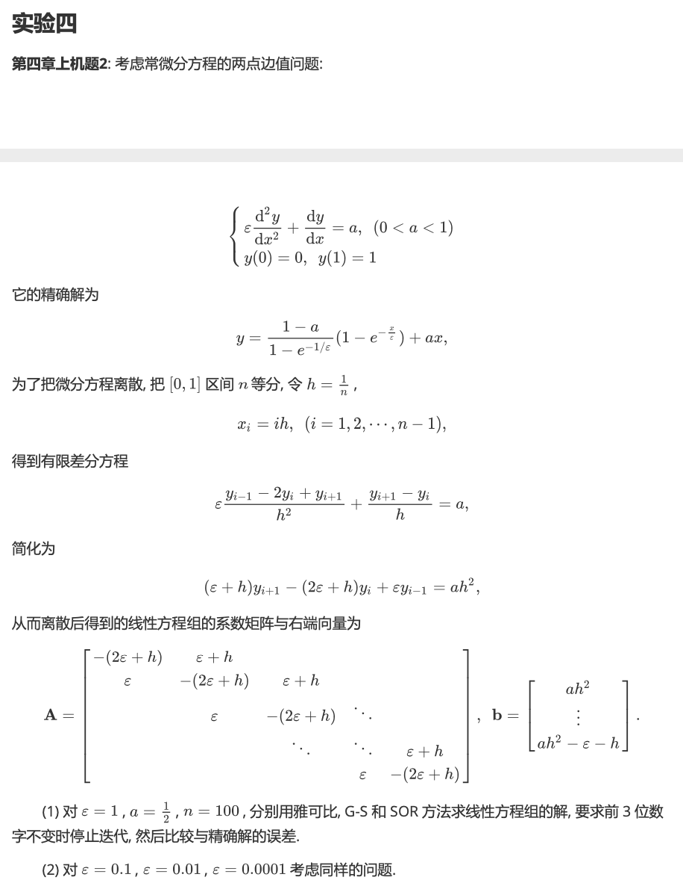
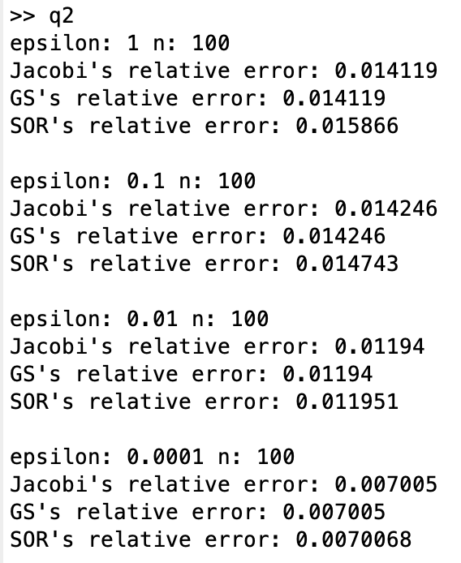

# Report Chap 4

成镇宇 2017080068 计76

## 实验一

### 实验题目



### 解题思路 && 实验结果

第一二题同时实现：

```matlab
for epsilon=[1, 0.1, 0.01, 0.0001] % epsilon = 1是第一题，其他的是第二题
    a = 1 / 2; % 设置a的初始值
    n = 100; % 设置n的初始值
    h = 1 / n; % 根据题中方法，计算h

    % 计算coefficient array
    A = zeros(n, n);
    i = 1;
    while i <= n
        A(i, i) = - (2 * epsilon + h);
        i = i + 1;
    end
    i = 1;
    while i < n
        A(i, i + 1) = epsilon + h;
        A(i + 1, i) = epsilon;
        i = i + 1;
    end

    % 计算右边向量
    b = ones(n, 1) * a * h^2;
    b(n) = b(n) - epsilon - h;

    % transforming矩阵
    trans = A + (2 * epsilon + h) * eye(n);
    
    % 从function中获取所有的x
    xs = ((1 - a) / (1 - exp(- (1 / epsilon))) * (1-exp(- (1/n : 1/n : 1) / epsilon)) + a * (1/n : 1/n : 1)).';
    
    % Jacobi方法
    ykk = zeros(n, 1);
    yk = ones(n, 1);
    while sum(abs(yk - ykk)) > 0.0001
        yk = ykk;
        ykk = (trans * yk - b) / (2 * epsilon + h);
    end
    y_jacobi = ykk;

    % G-S方法
    ykk = zeros(n, 1);
    yk = ones(n, 1);
    while sum(abs(yk - ykk)) > 0.0001
        yk = ykk;
        i = 1;
        while i <= n
            tmp = ((trans * yk - b) / (2 * epsilon + h));
            ykk(i) = tmp(i);
            i = i + 1;
        end
    end
    y_gs = ykk;

    % SOR方法
    omega = 0.8;
    ykk = zeros(n, 1);
    yk = ones(n, 1);
    while sum(abs(yk - ykk)) > 0.0001
        yk = ykk;
        i = 1;
        while i <= n
            tmp = ((trans * yk - b) / (2 * epsilon + h));
            ykk(i) = omega * tmp(i) + (1 - omega) * yk(i);
            i = i + 1;
        end
    end
    y_sor = ykk;

		% 显示结果
    disp("epsilon: " + epsilon + " n: " + n);
    disp("Jacobi's relative error: " + mean(abs((y_jacobi - xs)./ xs)));
    disp("GS's relative error: " + mean(abs((y_gs - xs)./ xs)));
    disp("SOR's relative error: " + mean(abs((y_sor - xs)./ xs)));
    fprintf("\n");
end
```



